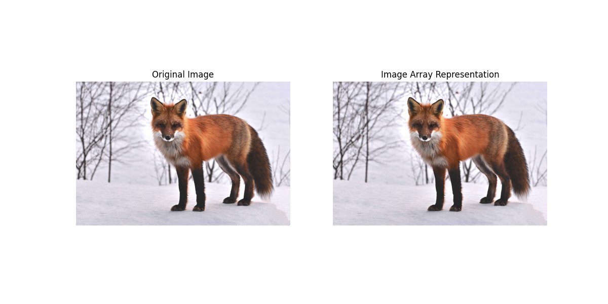

# Chapter 2:Digital Image Processing Fundamentals


## Overview

This chapter introduces the fundamental concepts of digital image processing. It includes the system components, basic image acquisition, sampling, quantization, and representation techniques.


## 1.Image Acquisition

- Physical devices like cameras capture electromagnetic energy and convert it to an electrical signal.
- Digitizers convert the electrical signals to digital form.
  


### Python (OpenCV)

```python

import cv2  # Import the OpenCV library for image processing
import matplotlib.pyplot as plt  # Import Matplotlib for plotting
from file_handler import get_image_path  # Import the function to get the image path

# Get the image path using the provided function
path = get_image_path()

# Read the image from the specified path
img = cv2.imread(path)

# Convert the image from BGR to RGB format (OpenCV uses BGR by default)
img_rgb = cv2.cvtColor(img, cv2.COLOR_BGR2RGB)

# Create a figure to display the image
plt.figure(figsize=(8, 6))  # Set the figure size

# Display the original image
plt.imshow(img_rgb)  # Show the original image
plt.title('Original Image')  # Title for the image
plt.axis('off')  # Hide axes

# Show the figure
plt.tight_layout()  # Adjust layout for better spacing
plt.show()  # Display the image

```
### MATLAB Code

```matlab

% Read the image from the specified file
I = imread('image.jpg');  % Replace 'image.jpg' with your actual image path

% Create a new figure window for the image
figure;  % Open a new figure window

% Display the image
imshow(I);  % Show the image

% Set the title of the displayed image to 'Original Image'
title('Original Image');  % Title for the displayed image

```


---
## 2.Image Formation Model

An image is defined as:

\[
f(x, y) = i(x, y) \cdot r(x, y)
\]

Where:
- \(i(x, y)\): Illumination
- \(r(x, y)\): Reflectance

### Python(OpenCV)

```python
# Import NumPy for numerical operations
import numpy as np  
# Import Matplotlib for plotting
import matplotlib.pyplot as plt  
# Import the function to get the image path
from file_handler import get_image_path  

# Get the image path using the provided function
path = get_image_path(path)
# Define the height and width of the image
height, width = 100, 100

# Create a 2D array (image) initialized to zeros
image = np.zeros((height, width))

# Fill the image with values based on the formula
for i in range(height):
    for j in range(width):
        image[i, j] = (i + j) / (height + width)  # Normalize the pixel values

# Display the image
plt.imshow(image, cmap='gray')  # Show the image using a grayscale colormap
plt.title("Image Formation Model (Python)")  # Set the title of the plot
plt.axis('off')  # Hide the axes for a cleaner look
plt.show()  # Render the plo
```


### MATLAB Code

```matlab
% Create a simple image (a gradient)
height = 100; % Define the height of the image
width = 100;  % Define the width of the image
image = zeros(height, width); % Initialize a 2D array filled with zeros

% Fill the image with values based on the formula
for i = 1:height % Loop through each row
    for j = 1:width % Loop through each column
        image(i, j) = (i + j) / (height + width); % Normalize the pixel values
    end
end

% Display the image
imshow(image, []); % Show the image with automatic scaling
title('Image Formation Model (MATLAB)'); % Set the title of the displayed image

```


---

## 4.Digital Image Representation

- Digital image = Matrix of intensity values.
- Resolution = Sampling density + gray-level depth.


---

### OpenCV (Python)

```python

import cv2  # Import the OpenCV library for image processing (not used in this snippet)
from PIL import Image  # Import the Pillow library to work with images
import numpy as np  # Import NumPy to represent images as arrays
import matplotlib.pyplot as plt  # Import Matplotlib for plotting

from file_handler import get_image_path  # Import the function to get the image path

# Get the image path using the provided function
path = get_image_path()

# Load an image
image_path = path  # Use the path obtained from the function
image = Image.open(image_path)  # Open the image using Pillow

# Convert the image to a NumPy array
image_array = np.array(image)  # Convert the image to a NumPy array

# Display the image and its array representation
plt.figure(figsize=(8, 6))  # Set the figure size for the plot

# Display the original image
plt.subplot(1, 2, 1)  # Create a subplot for the original image
plt.imshow(image)  # Show the original image
plt.title("Original Image")  # Set the title for the original image
plt.axis('off')  # Hide the axes

# Display the array representation of the image
plt.subplot(1, 2, 2)  # Create a subplot for the image array
plt.imshow(image_array)  # Show the image array
plt.title("Image Array Representation")  # Set the title for the array representation
plt.axis('off')  # Hide the axes

plt.show()  # Render the entire plot

```

### MATLAB Code

```matlab

% Load an image
image_path = 'path_to_your_image.jpg';  % Replace with your image path
image = imread(image_path);  % Read the image from the specified path

% Create a new figure for displaying images
figure;

% Display the original image
subplot(1, 2, 1);  % Create a subplot for the original image
imshow(image);  % Show the original image
title('Original Image');  % Set the title for the original image

% Display the matrix representation of the image
subplot(1, 2, 2);  % Create a subplot for the image matrix
imagesc(image);  % Display the matrix representation of the image
title('Image Matrix Representation');  % Set the title for the matrix representation
axis off;  % Turn off the axes for a cleaner look
```


---

## 5.Storage and Display

- Storage Types:
  - Short-term
  - On-line
  - Archival
  - Display is vital for observing results.
  - Communication includes local (LAN) and remote methods.

---
### Note
Higher resolution means better approximation of the original image.

