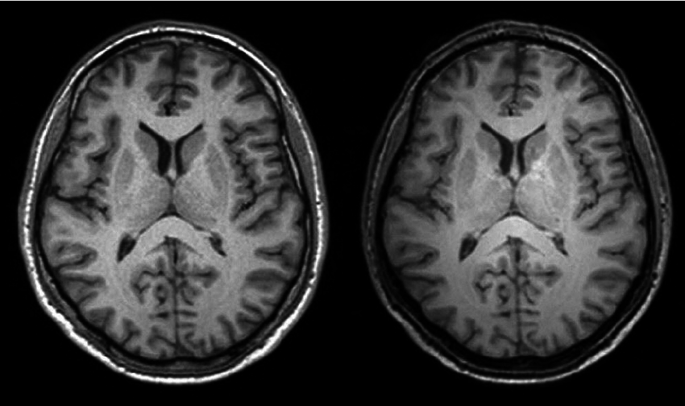
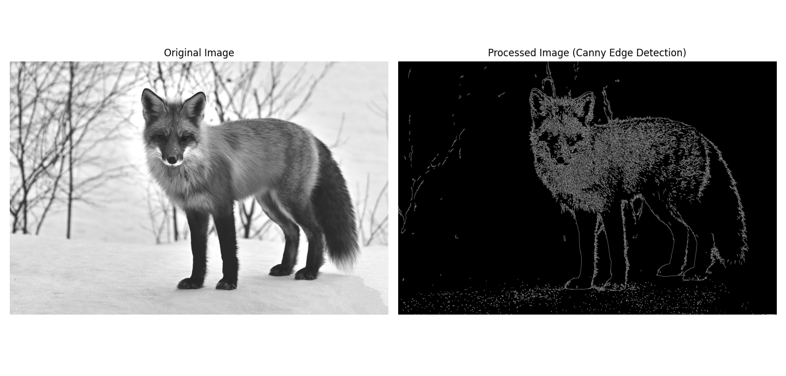
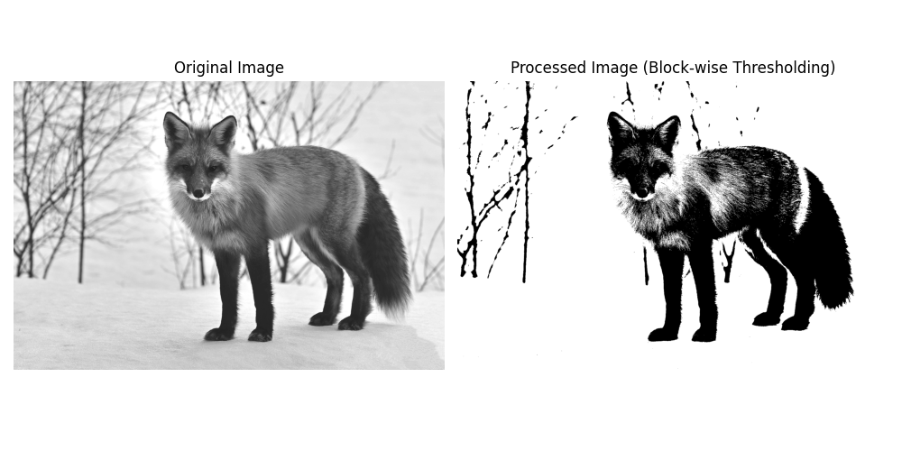
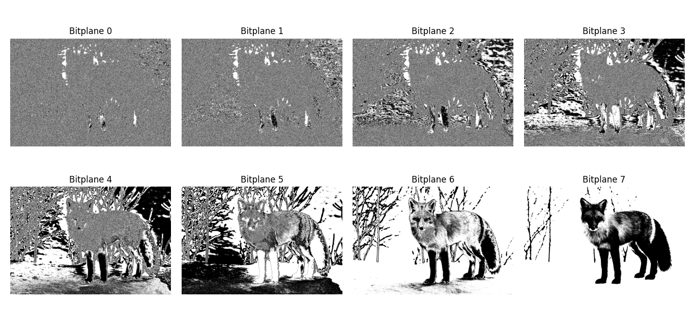
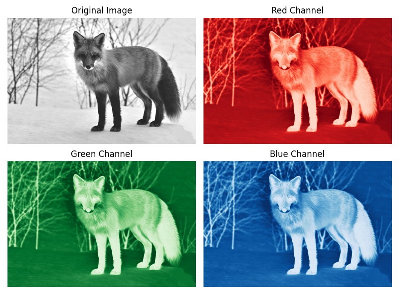

# Chapter 2:Image Representation


  <video width="800" height="410" controls>
    <source src="phOotos/imagerepresentation.mp4" type="video/mp4">
    Your browser does not support the video tag.
  </video


---
## Overview

This chapter introduces the fundamentals of digital image representation, including the electromagnetic spectrum, image resolution, bit-plane slicing, the human visual system (HVS), color models, and core applications in image processing.

---

## Scales of Imaging

Digital imaging spans a huge range of physical scales, from astronomical to microscopic.



---

## 2.Digital Image Formation

### Canny edge detection

Digital images are matrices of pixel values.

#### python code (OpenCV) 

```python

import cv2  # Import the OpenCV library for image processing
import matplotlib.pyplot as plt  # Import Matplotlib for plotting
from file_handler import get_image_path 

# Open an image file
path = get_image_path()

# Load the image in grayscale
img = cv2.imread(path, cv2.IMREAD_GRAYSCALE)  # Read the image as a grayscale image

# Print the matrix representation of the image
print("Matrix Representation of the Original Image:")
print(img)  # Display the matrix representation of the original image

# Process the image (e.g., apply Canny Edge Detection)
processed_img = cv2.Canny(img, 100, 200)  # Apply Canny edge detection

# Create a figure to display the original and processed images
plt.figure(figsize=(12, 6))  # Set the figure size

# Display the original image
plt.subplot(1, 2, 1)  # 1 row, 2 columns, 1st subplot
plt.imshow(img, cmap='gray')  # Show the original image
plt.title('Original Image')  # Title for the original image
plt.axis('off')  # Hide axes

# Display the processed image
plt.subplot(1, 2, 2)  # 1 row, 2 columns, 2nd subplot
plt.imshow(processed_img, cmap='gray')  # Show the processed image
plt.title('Processed Image (Canny Edge Detection)')  # Title for the processed image
plt.axis('off')  # Hide axes

# Show the combined figure
plt.tight_layout()  # Adjust layout for better spacing
plt.show()  # Display the images

```

#### MATLAB code

```matlab


% Load the image in grayscale
img = imread(path);  % Read the image as a grayscale image

% Print the matrix representation of the image
disp('Matrix Representation of the Original Image:');
disp(img);  % Display the matrix representation of the original image

% Process the image (e.g., apply Canny Edge Detection)
processed_img = edge(img, 'Canny', [0.1, 0.2]);  % Apply Canny edge detection

% Create a figure to display the original and processed images
figure('Position', [100, 100, 1200, 600]);  % Set the figure size

% Display the original image
subplot(1, 2, 1);  % 1 row, 2 columns, 1st subplot
imshow(img);  % Show the original image
title('Original Image');  % Title for the original image
axis off;  % Hide axes

% Display the processed image
subplot(1, 2, 2);  % 1 row, 2 columns, 2nd subplot
imshow(processed_img);  % Show the processed image
title('Processed Image (Canny Edge Detection)');  % Title for the processed image
axis off;  % Hide axes

% Show the combined figure
tight_layout();  % Note: MATLAB does not have a direct equivalent, but this can adjust layout

```




---

### 3.Block-wise Representation


#### python code (OpenCV)

```python

import cv2  # Import the OpenCV library for image processing
import cv2  # Import the OpenCV library for image processing
import numpy as np  # Import NumPy for numerical operations
import matplotlib.pyplot as plt  # Import Matplotlib for plotting
from file_handler import get_image_path 

# Open an image file
path = get_image_path()
# Load the image in grayscale
img = cv2.imread(path , cv2.IMREAD_GRAYSCALE)  # Read the image as a grayscale image

# Print the matrix representation of the original image
print("Matrix Representation of the Original Image:")
print(img)  # Display the matrix representation of the original image

# Define block size
block_size = 50  # Size of the block (50x50 pixels)

# Get the size of the image
rows, cols = img.shape

# Initialize the processed image
processed_img = np.zeros_like(img)  # Create an empty image for processed results

# Loop through the image in blocks
for r in range(0, rows, block_size):
    for c in range(0, cols, block_size):
        # Define the block boundaries
        block = img[r:min(r + block_size, rows), c:min(c + block_size, cols)]

        # Process the block (e.g., apply a simple threshold)
        _, processed_block = cv2.threshold(block, 128, 255, cv2.THRESH_BINARY)  # Apply binary thresholding

        # Place the processed block back into the processed image
        processed_img[r:min(r + block_size, rows), c:min(c + block_size, cols)] = processed_block

# Create a figure to display the original and processed images
plt.figure(figsize=(10, 5))  # Set the figure size

# Display the original image
plt.subplot(1, 2, 1)  # 1 row, 2 columns, 1st subplot
plt.imshow(img, cmap='gray')  # Show the original image
plt.title('Original Image')  # Title for the original image
plt.axis('off')  # Hide axes

# Display the processed image
plt.subplot(1, 2, 2)  # 1 row, 2 columns, 2nd subplot
plt.imshow(processed_img, cmap='gray') # Show the processed image
plt.title('Processed Image (Block-wise Thresholding)') # Title for the processed image
plt.axis('off')  # Hide axes

# Show the combined figure
plt.tight_layout()  # Adjust layout for better spacing
plt.show()  # Display the images
```
#### MATLAB code

```matlab
% Load the image in grayscale
img = imread('path.png');  % Read the image as a grayscale image

% Print the matrix representation of the original image
disp('Matrix Representation of the Original Image:');
disp(img);  % Display the matrix representation of the original image

% Define block size
block_size = 50;  % Size of the block (50x50 pixels)

% Get the size of the image
[rows, cols] = size(img);

% Initialize the processed image
processed_img = zeros(size(img), 'uint8');  % Create an empty image for processed results

% Loop through the image in blocks
for r = 1:block_size:rows
    for c = 1:block_size:cols
        % Define the block boundaries
        block = img(r:min(r + block_size - 1, rows), c:min(c + block_size - 1, cols));

        % Process the block (e.g., apply binary thresholding)
        processed_block = block > 128;  % Apply binary thresholding
        processed_block = uint8(processed_block) * 255;  % Convert logical array to uint8

        % Place the processed block back into the processed image
        processed_img(r:min(r + block_size - 1, rows), c:min(c + block_size - 1, cols)) = processed_block;
    end
end

% Create a figure to display the original and processed images
figure('Position', [100, 100, 1200, 600]);  % Set the figure size

% Display the original image
subplot(1, 2, 1);  % 1 row, 2 columns, 1st subplot
imshow(img);  % Show the original image
title('Original Image');  % Title for the original image
axis off;  % Hide axes

% Display the processed image
subplot(1, 2, 2);  % 1 row, 2 columns, 2nd subplot
imshow(processed_img);  % Show the processed image
title('Processed Image (Block-wise Thresholding)');  % Title for the processed image
axis off;  % Hide axes

% Show the combined figure
tight_layout();  % Note: MATLAB does not have a direct equivalent, but this can adjust layout

```




---

## 3.Bit-Plane Slicing

- Decomposes an 8-bit image into binary slices (planes).

### python (OpenCV) example
```python

import cv2  # Import the OpenCV library for image processing
import matplotlib.pyplot as plt  # Import Matplotlib for plotting
from file_handler import get_image_path 

# Open an image file
path = get_image_path()

# Load the image in grayscale
img = cv2.imread(path, cv2.IMREAD_GRAYSCALE)  # Read the image as a grayscale image

# Create a figure to display the bit planes
fig, axes = plt.subplots(2, 4, figsize=(10, 5))  # Create a 2x4 subplot

# Loop through the 8 bit planes
for i in range(8):
    # Extract the i-th bit plane
    plane = (img >> i) & 1  # Get the i-th bit plane

    # Display the bit plane
    ax = axes[i // 4, i % 4]  # Determine the current axis
    ax.imshow(plane, cmap='gray')  # Show the bit plane
    ax.set_title(f'Bitplane {i}')  # Title for the bit plane
    ax.axis('off')  # Hide axes

# Adjust layout for better spacing
plt.tight_layout()  # Adjust layout
plt.show()  # Display the images

```

### MATLAB Code

```matlab

% Load the image in grayscale
img = imread('man.png');  % Read the image as a grayscale image

% Convert the image to uint8 if it's not already
img = uint8(img);

% Create a figure to display the bit planes
figure('Position', [100, 100, 1200, 300]);  % Set the figure size

% Loop through the 8 bit planes
for i = 0:7
    % Extract the i-th bit plane
    plane = bitand(bitshift(img, -i), 1);  % Get the i-th bit plane

    % Display the bit plane
    subplot(2, 4, i+1);  % 2 rows, 4 columns
    imshow(plane, []);  % Show the bit plane
    title(['Bitplane ' num2str(i)]);  % Title for the bit plane
    axis off;  % Hide axes
end

% Adjust layout for better spacing
tight_layout();  % Note: MATLAB does not have a direct equivalent

```


---

## 4.Color Representation


### python (OpenCV) example

```python

import cv2  # Import the OpenCV library for image processing
import numpy as np  # Import NumPy for numerical operations
import matplotlib.pyplot as plt  # Import Matplotlib for plotting
from file_handler import get_image_path 

# Open an image file
path = get_image_path()

# Load the image in grayscale
img = cv2.imread(path, cv2.IMREAD_GRAYSCALE)  # Read the image as a grayscale image

# Convert the image from BGR to RGB format (OpenCV uses BGR by default)
img_rgb = cv2.cvtColor(img, cv2.COLOR_BGR2RGB)

# Split the image into its color channels
r, g, b = cv2.split(img_rgb)

# Create a figure to display the color channels
fig, axes = plt.subplots(2, 2, figsize=(8, 6))  # Create a 2x2 subplot

# Display the original image
axes[0, 0].imshow(img_rgb)  # Show the original image
axes[0, 0].set_title('Original Image')  # Title for the original image
axes[0, 0].axis('off')  # Hide axes

# Display the red channel
axes[0, 1].imshow(r, cmap='Reds')  # Show the red channel
axes[0, 1].set_title('Red Channel')  # Title for the red channel
axes[0, 1].axis('off')  # Hide axes

# Display the green channel
axes[1, 0].imshow(g, cmap='Greens')  # Show the green channel
axes[1, 0].set_title('Green Channel')  # Title for the green channel
axes[1, 0].axis('off')  # Hide axes

# Display the blue channel
axes[1, 1].imshow(b, cmap='Blues')  # Show the blue channel
axes[1, 1].set_title('Blue Channel')  # Title for the blue channel
axes[1, 1].axis('off')  # Hide axes

# Adjust layout for better spacing
plt.tight_layout()  # Adjust layout
plt.show()  # Display the images

```


### MATLAB example

```matlab

% Load the image
img = imread('color_image.jpg');  % Replace with your image path

% Convert the image from RGB to separate channels
r = img(:, :, 1);  % Red channel
g = img(:, :, 2);  % Green channel
b = img(:, :, 3);  % Blue channel

% Create a figure to display the color channels
figure('Position', [100, 100, 800, 600]);  % Set the figure size

% Display the original image
subplot(2, 2, 1);  % 2 rows, 2 columns, 1st subplot
imshow(img);  % Show the original image
title('Original Image');  % Title for the original image
axis off;  % Hide axes

% Display the red channel
subplot(2, 2, 2);  % 2 rows, 2 columns, 2nd subplot
imshow(r);  % Show the red channel
title('Red Channel');  % Title for the red channel
axis off;  % Hide axes

% Display the green channel
subplot(2, 2, 3);  % 2 rows, 2 columns, 3rd subplot
imshow(g);  % Show the green channel
title('Green Channel');  % Title for the green channel
axis off;  % Hide axes

% Display the blue channel
subplot(2, 2, 4);  % 2 rows, 2 columns, 4th subplot
imshow(b);  % Show the blue channel
title('Blue Channel');  % Title for the blue channel
axis off;  % Hide axes

% Adjust layout for better spacing
tight_layout();  % Note: MATLAB does not have a direct equivalent

```


---

