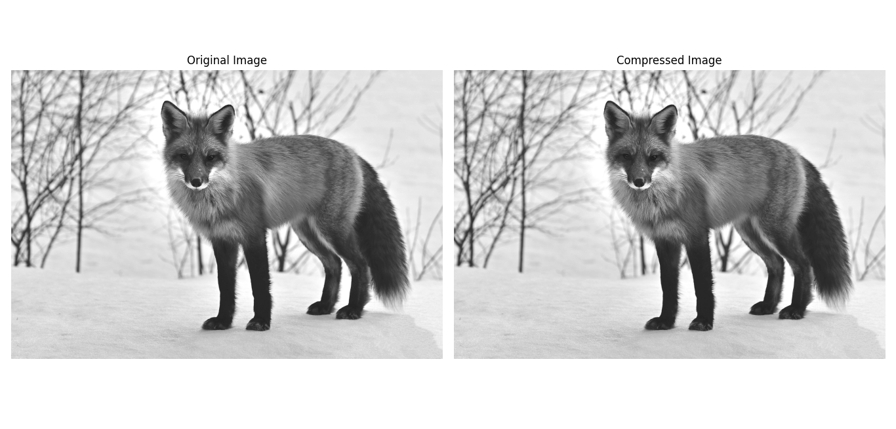

# 6.Compression (JPEG, JPEG2000)

- Compression Ratio (CR) = Original Size / Compressed Size


## Python (OpenCV)

```python

 # Import the OpenCV library for image processing
import cv2 
# Import os to handle file sizes
import os  
# Import Matplotlib for plotting
import matplotlib.pyplot as plt  
# Assuming this function retrieves the image path
from file_handler import get_image_path  

# Open an image file
path = get_image_path()

# Load the image in grayscale
img = cv2.imread(path, cv2.IMREAD_GRAYSCALE) 

# Get the size of the original image
original_size = os.path.getsize(path)  # Size in bytes

# Save the image as a compressed JPEG file
# Specify a valid path for the compressed image
compressed_image_path = 'compressed_image.jpg'  
 # Quality can be adjusted
cv2.imwrite(compressed_image_path, img, [int(cv2.IMWRITE_JPEG_QUALITY), 90]) 

# Get the size of the compressed image
compressed_size = os.path.getsize(compressed_image_path)  # Size in bytes

# Calculate the compression ratio
compression_ratio = original_size / compressed_size

# Print the results
print(f"Size of Original Image: {original_size} bytes")
print(f"Size of Compressed Image: {compressed_size} bytes")
print(f"Compression Ratio: {compression_ratio:.2f}")

# Load the compressed image for display
compressed_img = cv2.imread(compressed_image_path, cv2.IMREAD_GRAYSCALE)

# Create a figure to display the original and compressed images
plt.figure(figsize=(12, 6))  # Set the figure size

# Display the original image
plt.subplot(1, 2, 1)  # 1 row, 2 columns, 1st subplot
plt.imshow(img, cmap='gray')  # Show the original image
plt.title('Original Image')  # Title for the original image
plt.axis('off')  # Hide axes

# Display the compressed image
plt.subplot(1, 2, 2)  # 1 row, 2 columns, 2nd subplot
plt.imshow(compressed_img, cmap='gray')  # Show the compressed image
plt.title('Compressed Image')  # Title for the compressed image
plt.axis('off')  # Hide axes

# Show the combined figure
plt.tight_layout()  # Adjust layout for better spacing
plt.show()  # Display the images

```

## MATLAB Code 

```matlab

% Load the image in grayscale
img = imread('original_image.jpg');  % Replace with your image path

% Get the size of the original image
original_info = dir('original_image.jpg');  % Get file information
original_size = original_info.bytes;  % Size in bytes

% Save the image as a compressed JPEG file
compressed_image_path = 'compressed_image.jpg';  % Specify a valid path for the compressed image
imwrite(img, compressed_image_path, 'Quality', 90);  % Quality can be adjusted

% Get the size of the compressed image
compressed_info = dir(compressed_image_path);  % Get file information
compressed_size = compressed_info.bytes;  % Size in bytes

% Calculate the compression ratio
compression_ratio = original_size / compressed_size;

% Print the results
fprintf('Size of Original Image: %d bytes\n', original_size);
fprintf('Size of Compressed Image: %d bytes\n', compressed_size);
fprintf('Compression Ratio: %.2f\n', compression_ratio);

% Load the compressed image for display
compressed_img = imread(compressed_image_path);  % Load the compressed image

% Create a figure to display the original and compressed images
figure('Position', [100, 100, 800, 400]);  % Set the figure size

% Display the original image
subplot(1, 2, 1);  % 1 row, 2 columns, 1st subplot
imshow(img);  % Show the original image
title('Original Image');  % Title for the original image
axis off;  % Hide axes

% Display the compressed image
subplot(1, 2, 2);  % 1 row, 2 columns, 2nd subplot
imshow(compressed_img);  % Show the compressed image
title('Compressed Image');  % Title for the compressed image
axis off;  % Hide axes

% Adjust layout for better spacing
tight_layout();  % Note: MATLAB does not have a direct equivalent

```




---
